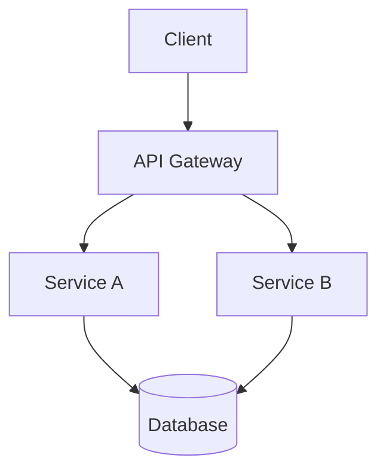

# Codebase Analysis Report Template

## Instructions

Copy this template and fill in each section during analysis. Delete sections that don't apply.

---

# [Project Name] - Codebase Analysis Report

**Date:** YYYY-MM-DD
**Analyst:** [Name]
**Commit:** [SHA]

## Executive Summary

[2-3 sentences: what the project does, overall health, top concern.]

## Architecture Score: X/10

[One paragraph explaining the score. Key strengths and weaknesses.]

## Structural Overview

| Metric | Value |
|--------|-------|
| Language | |
| Framework | |
| Total source files | |
| Total LOC (excl. generated) | |
| Entry points | |
| Test files | |
| Test LOC | |
| Dependencies (direct) | |
| Dependencies (transitive) | |

### Directory Map

```
project-root/
  src/           (X files, ~Y LOC) - [purpose]
  tests/         (X files, ~Y LOC) - [purpose]
  migrations/    (X files) - [purpose]
  config/        - [purpose]
```

### Entry Points

| Entry Point | File | Purpose |
|-------------|------|---------|
| | | |

## Data Layer

### Entity Map

| Entity | Representations | Authoritative Source |
|--------|----------------|---------------------|
| | | |

### Data Flow

```
[Source] --> [Validation] --> [Transform] --> [Storage] --> [External Sync]
```

### Issues

- [ ] Schema drift between code and migrations
- [ ] Multiple sources of truth
- [ ] Missing conversion functions
- [ ] No audit trail for changes

## The Good

[List things that are well-designed, well-tested, or should not be changed.]

1. ...
2. ...

## Critical Issues (P0-P1)

| # | Issue | Location | Impact | Fix | Effort |
|---|-------|----------|--------|-----|--------|
| 1 | | file:line | | | |
| 2 | | file:line | | | |

## Performance and Reliability (P2)

| # | Issue | Location | Impact | Fix | Effort |
|---|-------|----------|--------|-----|--------|
| 1 | | file:line | | | |

## Code Quality (P3-P4)

| # | Issue | Location | Impact | Fix | Effort |
|---|-------|----------|--------|-----|--------|
| 1 | | file:line | | | |

## Concurrency Audit

- [ ] All goroutines/threads have panic recovery
- [ ] All mutexes have deferred release
- [ ] All channels have timeout or context cancellation
- [ ] No goroutine/thread can leak
- [ ] Worker pools have clean shutdown

## Error Handling Audit

- [ ] No swallowed errors (`_ = fn()`, empty catch)
- [ ] Errors propagate to caller with context
- [ ] Batch operations report per-item failures
- [ ] External service calls have retry + timeout

## Dead Code

| File | Line | Description |
|------|------|-------------|
| | | |

## Recommended Fix Order

1. [First fix and why it's highest priority]
2. [Second fix]
3. [Third fix]

## Architecture Diagram



## Appendix: Language-Specific Checks

### Go
- [ ] `go vet ./...` passes
- [ ] `go test -race ./...` passes
- [ ] Context propagation consistent

### TypeScript
- [ ] No `any` types
- [ ] All promises handled
- [ ] Lock file committed

### Python
- [ ] Type hints on public functions
- [ ] No bare `except:`
- [ ] No `import *`
