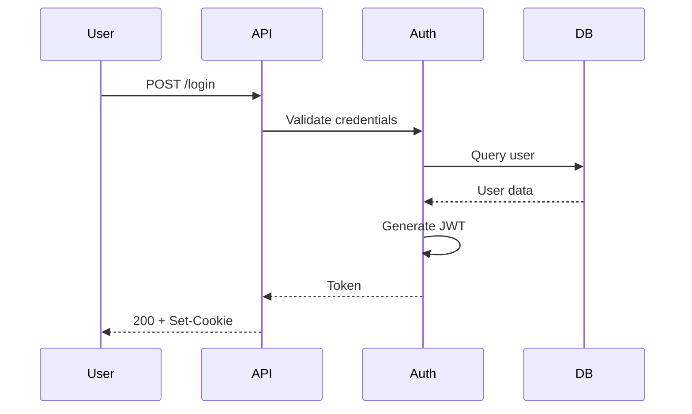
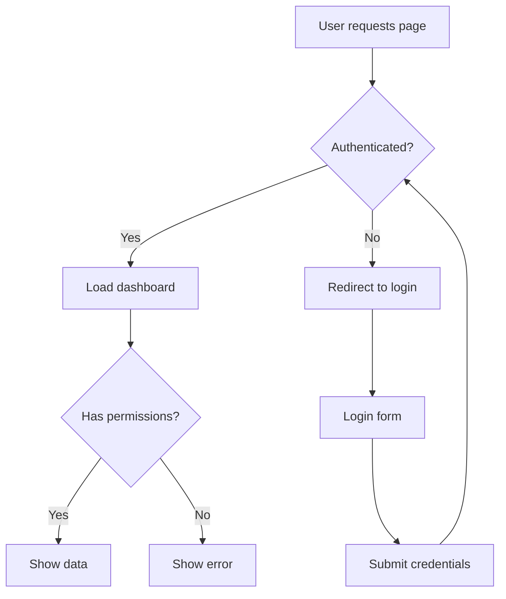
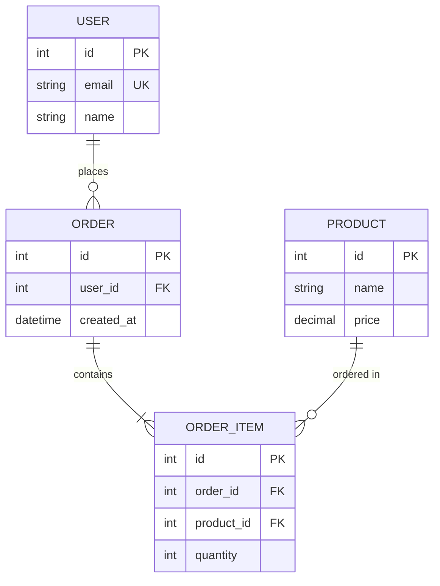

# Documentation Generation

## OpenAPI Documentation

### Step 1: Generate from Code

**TypeScript with tsoa:**

```typescript
// src/controllers/UserController.ts
import { Controller, Get, Post, Route, Body, Path } from 'tsoa';

interface User {
  id: number;
  name: string;
  email: string;
}

@Route('users')
export class UserController extends Controller {
  /**
   * Retrieves a user by ID
   * @param userId The user's ID
   */
  @Get('{userId}')
  public async getUser(@Path() userId: number): Promise<User> {
    return { id: userId, name: 'John', email: 'john@example.com' };
  }

  /**
   * Creates a new user
   */
  @Post()
  public async createUser(@Body() requestBody: User): Promise<User> {
    return requestBody;
  }
}
```

Generate spec:
```bash
# Install tsoa
npm install tsoa

# Generate OpenAPI spec
npx tsoa spec

# Output: swagger.json
```

**Go with swaggo:**

```go
// main.go
package main

import "github.com/gin-gonic/gin"

// @Summary Get user by ID
// @Description Retrieves user information
// @Tags users
// @Produce json
// @Param id path int true "User ID"
// @Success 200 {object} User
// @Router /users/{id} [get]
func getUser(c *gin.Context) {
    // Implementation
}

type User struct {
    ID    int    `json:"id" example:"1"`
    Name  string `json:"name" example:"John Doe"`
    Email string `json:"email" example:"john@example.com"`
}

// @title User API
// @version 1.0
// @description User management API
// @host localhost:8080
// @BasePath /api/v1
func main() {
    // Setup
}
```

Generate spec:
```bash
# Install swag
go install github.com/swaggo/swag/cmd/swag@latest

# Generate
swag init

# Output: docs/swagger.json
```

**Python with FastAPI:**

```python
# main.py
from fastapi import FastAPI
from pydantic import BaseModel

app = FastAPI(title="User API", version="1.0.0")

class User(BaseModel):
    id: int
    name: str
    email: str

    class Config:
        json_schema_extra = {
            "example": {
                "id": 1,
                "name": "John Doe",
                "email": "john@example.com"
            }
        }

@app.get("/users/{user_id}", response_model=User)
async def get_user(user_id: int):
    """
    Retrieve a user by ID.

    - **user_id**: The user's unique identifier
    """
    return User(id=user_id, name="John", email="john@example.com")

# OpenAPI auto-generated at /openapi.json
```

### Step 2: Validate and Lint Specs

```bash
# Install Spectral
npm install -g @stoplight/spectral-cli

# Create .spectral.yaml
cat > .spectral.yaml << EOF
extends: ["spectral:oas"]
rules:
  operation-description: error
  operation-tags: error
EOF

# Lint spec
spectral lint openapi.yaml
```

**BAD - Missing descriptions:**
```yaml
paths:
  /users/{id}:
    get:
      summary: Get user
      # No description, no examples
```

**GOOD - Complete documentation:**
```yaml
paths:
  /users/{id}:
    get:
      summary: Get user by ID
      description: |
        Retrieves detailed user information including profile data,
        preferences, and account status.
      tags: [users]
      parameters:
        - name: id
          in: path
          required: true
          schema:
            type: integer
          example: 42
      responses:
        '200':
          description: User found
          content:
            application/json:
              example:
                id: 42
                name: "John Doe"
                email: "john@example.com"
```

### Step 3: Render Interactive Docs

```bash
# Serve with Swagger UI
npx swagger-ui-serve openapi.yaml

# Or embed in Express
npm install swagger-ui-express
```

```javascript
// server.js
const swaggerUi = require('swagger-ui-express');
const swaggerDocument = require('./swagger.json');

app.use('/docs', swaggerUi.serve, swaggerUi.setup(swaggerDocument));
```

## GraphQL Documentation

### Step 1: Extract Schema

```bash
# Using introspection
npx get-graphql-schema http://localhost:4000/graphql > schema.graphql

# Or from code (Apollo Server)
npm install @graphql-tools/schema
```

```typescript
// Extract schema from TypeScript
import { printSchema } from 'graphql';
import { schema } from './schema';
import { writeFileSync } from 'fs';

writeFileSync('schema.graphql', printSchema(schema));
```

### Step 2: Generate TypeScript Types

```yaml
# codegen.yml
overwrite: true
schema: "http://localhost:4000/graphql"
documents: "src/**/*.graphql"
generates:
  src/__generated__/types.ts:
    plugins:
      - "typescript"
      - "typescript-operations"
      - "typescript-react-apollo"
    config:
      withHooks: true
```

```bash
# Install codegen
npm install -D @graphql-codegen/cli @graphql-codegen/typescript

# Generate
npx graphql-codegen --config codegen.yml
```

**Result:**
```typescript
// __generated__/types.ts
export type User = {
  __typename?: 'User';
  id: Scalars['ID'];
  name: Scalars['String'];
  email: Scalars['String'];
};

export const useGetUserQuery = (
  options?: Omit<Urql.UseQueryArgs<GetUserQueryVariables>, 'query'>
) => Urql.useQuery<GetUserQuery>({ query: GetUserDocument, ...options });
```

### Step 3: Generate Static Docs

```bash
# Install SpectaQL
npm install -g spectaql

# Generate HTML docs
spectaql config.yml
```

```yaml
# config.yml
spectaql:
  servers:
    - url: http://localhost:4000/graphql
  introspection:
    schemaFile: schema.graphql
  options:
    targetFile: docs/api.html
```

## Mermaid Architecture Diagrams

### Step 1: Sequence Diagram

```markdown

```

**Renders to interactive diagram on GitHub/GitLab.**

### Step 2: Flowchart

```markdown

```

### Step 3: Entity Relationship

```markdown

```

### Step 4: Render to Static Image

```bash
# Install mermaid CLI
npm install -g @mermaid-js/mermaid-cli

# Render SVG
mmdc -i diagram.mmd -o diagram.svg

# Render PNG with background
mmdc -i diagram.mmd -o diagram.png -b transparent
```

## C4 Model Diagrams

### Step 1: Define System Context

```
workspace {
    model {
        user = person "User" "End user of the system"
        admin = person "Admin" "System administrator"

        system = softwareSystem "E-commerce Platform" {
            webapp = container "Web App" "Next.js" "Provides UI"
            api = container "API" "Go" "REST API"
            db = container "Database" "PostgreSQL" "Stores data"
            cache = container "Cache" "Redis" "Session storage"
        }

        email = softwareSystem "Email Service" "SendGrid" "Sends emails"
        payment = softwareSystem "Payment Gateway" "Stripe"

        user -> webapp "Uses"
        admin -> webapp "Administers"
        webapp -> api "Calls" "HTTPS/JSON"
        api -> db "Reads/Writes" "SQL"
        api -> cache "Caches" "Redis Protocol"
        api -> email "Sends via"
        api -> payment "Processes via"
    }

    views {
        systemContext system "SystemContext" {
            include *
            autolayout lr
        }

        container system "Containers" {
            include *
            autolayout lr
        }
    }
}
```

Save as `workspace.dsl`.

### Step 2: Render with Structurizr

```bash
# Using Docker
docker run -it --rm -v $(pwd):/usr/local/structurizr structurizr/lite

# Open http://localhost:8080
```

### Step 3: Export to PlantUML

```bash
# Install structurizr-cli
docker run -v $(pwd):/workspace structurizr/cli export -workspace workspace.dsl -format plantuml

# Render with PlantUML
docker run -v $(pwd):/data plantuml/plantuml *.puml
```

## README Generation

### Step 1: Scaffold with Template

```bash
# Interactive generator
npx readme-md-generator
```

**Manual template:**

```markdown
# Project Name

[](https://github.com/user/repo/actions)
[](LICENSE)

> One-sentence description of what this project does.

## Quick Start

```bash
git clone https://github.com/user/repo.git
cd repo
npm install
npm start
```

Visit http://localhost:3000

## Configuration

```bash
cp .env.example .env
# Edit .env with your settings
```

Required environment variables:
- `DATABASE_URL` - PostgreSQL connection string
- `JWT_SECRET` - Secret for signing tokens

## Architecture

See [architecture diagram](docs/architecture.svg) for system overview.

## Contributing

See [CONTRIBUTING.md](CONTRIBUTING.md) for development setup.

## License

MIT - see [LICENSE](LICENSE)
```

### Step 2: Auto-Generate Command Reference

```bash
# Extract CLI help
mycli --help > docs/commands.md

# Or programmatically
node -e "
const yargs = require('yargs');
const fs = require('fs');
const help = yargs.getHelp();
fs.writeFileSync('docs/cli.md', help);
"
```

## Changelog Automation

### Step 1: Use Conventional Commits

**Commit message format:**
```
type(scope): subject

body

footer
```

**Types:**
- `feat`: New feature
- `fix`: Bug fix
- `docs`: Documentation only
- `refactor`: Code change that neither fixes a bug nor adds a feature
- `perf`: Performance improvement
- `test`: Adding tests
- `chore`: Maintenance

**Examples:**
```bash
git commit -m "feat(auth): add JWT refresh token support"
git commit -m "fix(api): prevent race condition in user creation"
git commit -m "docs: update API authentication guide"
```

### Step 2: Generate Changelog

```bash
# Install standard-version
npm install -D standard-version

# First release
npx standard-version --first-release

# Subsequent releases
npx standard-version
```

**Generated CHANGELOG.md:**
```markdown
# Changelog

## [1.2.0](https://github.com/user/repo/compare/v1.1.0...v1.2.0) (2024-02-14)

### Features

* **auth:** add JWT refresh token support ([abc123](https://github.com/user/repo/commit/abc123))

### Bug Fixes

* **api:** prevent race condition in user creation ([def456](https://github.com/user/repo/commit/def456))
```

### Step 3: Automate with GitHub Actions

```yaml
# .github/workflows/release.yml
name: Release

on:
  push:
    branches: [main]

jobs:
  release:
    runs-on: ubuntu-latest
    steps:
      - uses: actions/checkout@v4
        with:
          fetch-depth: 0

      - uses: google-github-actions/release-please-action@v3
        with:
          release-type: node
          package-name: my-package
```

**Release Please creates a PR that:**
- Updates CHANGELOG.md
- Bumps version in package.json
- When merged, creates a GitHub Release

## CI Documentation Pipeline

```yaml
# .github/workflows/docs.yml
name: Documentation

on:
  push:
    branches: [main]

jobs:
  generate:
    runs-on: ubuntu-latest
    steps:
      - uses: actions/checkout@v4

      - name: Generate OpenAPI spec
        run: |
          npm run generate-openapi
          spectral lint openapi.yaml

      - name: Render Mermaid diagrams
        run: |
          npm install -g @mermaid-js/mermaid-cli
          mmdc -i docs/architecture.mmd -o docs/architecture.svg

      - name: Build docs site
        run: npm run docs:build

      - name: Deploy to GitHub Pages
        uses: peaceiris/actions-gh-pages@v3
        with:
          github_token: ${{ secrets.GITHUB_TOKEN }}
          publish_dir: ./docs-build
```

## Quick Reference

**OpenAPI Generation:**
```
TypeScript: tsoa, @nestjs/swagger
Go:         swaggo/swag
Python:     FastAPI (automatic)
```

**GraphQL Tools:**
```
Schema extraction: get-graphql-schema
Type generation:   @graphql-codegen/cli
Documentation:     SpectaQL, graphql-markdown
```

**Diagram Tools:**
```
Mermaid:  GitHub/GitLab native, mermaid-cli for export
C4:       Structurizr DSL + structurizr/cli
PlantUML: plantuml/plantuml Docker image
```

**Changelog Tools:**
```
standard-version:  Node-based, manual trigger
release-please:    GitHub Action, automated
conventional-changelog: Low-level library
```

---

**Use this skill**: When API docs drift from code, diagrams are out of date, or you need to automate release notes.
