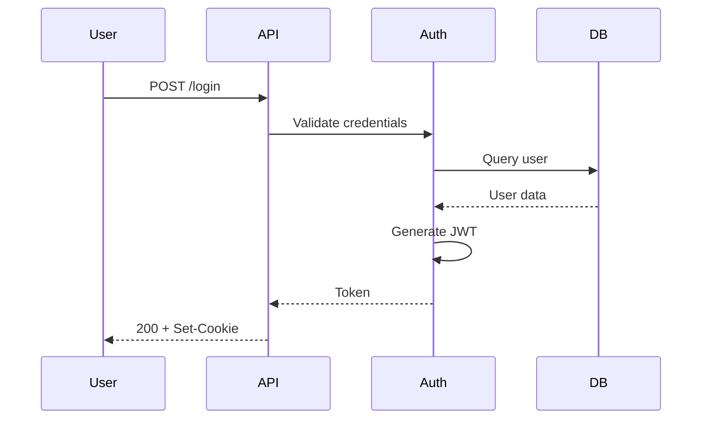
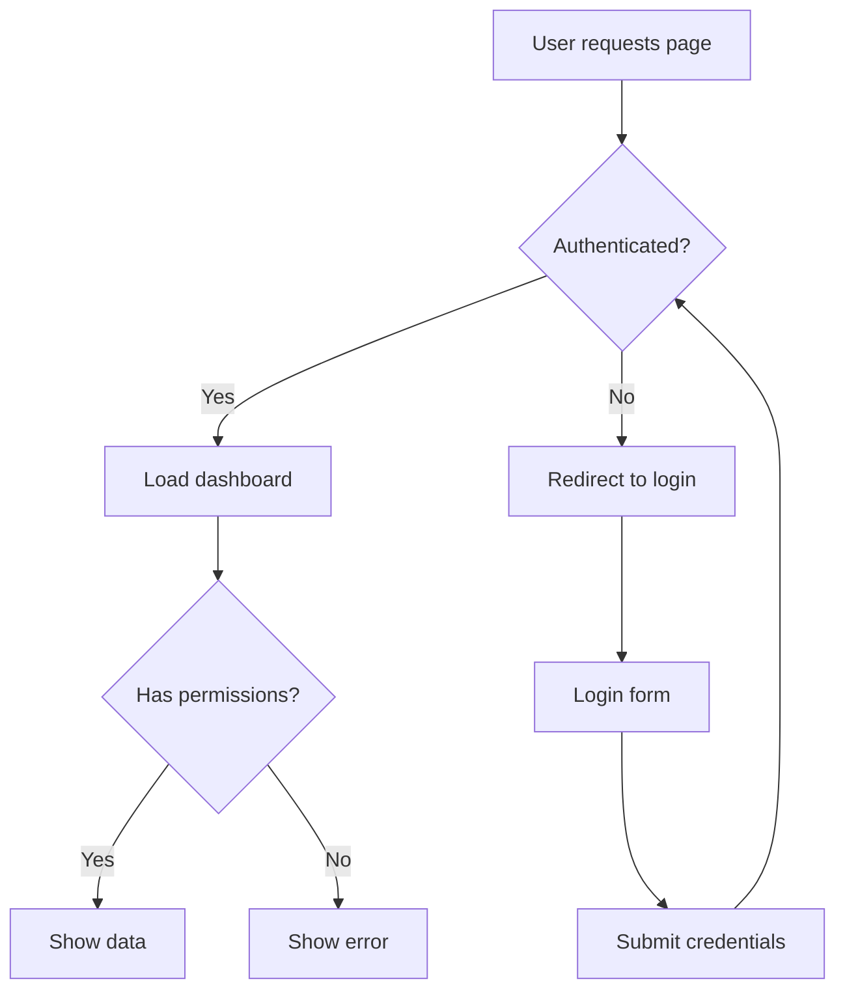
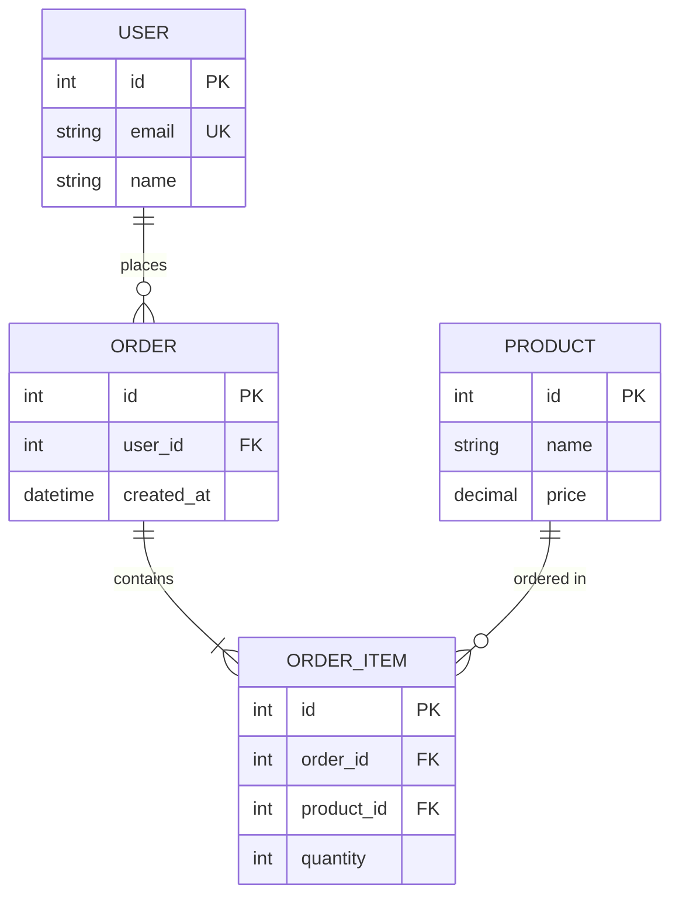

# Mermaid and C4 Architecture Diagrams

## Mermaid Sequence Diagram



Renders to interactive diagram on GitHub/GitLab.

## Mermaid Flowchart



## Mermaid Entity Relationship



## Render to Static Image

```bash
npm install -g @mermaid-js/mermaid-cli
mmdc -i diagram.mmd -o diagram.svg
mmdc -i diagram.mmd -o diagram.png -b transparent
```

## C4 Model: System Context

```
workspace {
    model {
        user = person "User" "End user of the system"
        admin = person "Admin" "System administrator"

        system = softwareSystem "E-commerce Platform" {
            webapp = container "Web App" "Next.js" "Provides UI"
            api = container "API" "Go" "REST API"
            db = container "Database" "PostgreSQL" "Stores data"
            cache = container "Cache" "Redis" "Session storage"
        }

        email = softwareSystem "Email Service" "SendGrid" "Sends emails"
        payment = softwareSystem "Payment Gateway" "Stripe"

        user -> webapp "Uses"
        admin -> webapp "Administers"
        webapp -> api "Calls" "HTTPS/JSON"
        api -> db "Reads/Writes" "SQL"
        api -> cache "Caches" "Redis Protocol"
        api -> email "Sends via"
        api -> payment "Processes via"
    }

    views {
        systemContext system "SystemContext" {
            include *
            autolayout lr
        }

        container system "Containers" {
            include *
            autolayout lr
        }
    }
}
```

Save as `workspace.dsl`.

## Render with Structurizr

```bash
# Using Docker
docker run -it --rm -v $(pwd):/usr/local/structurizr structurizr/lite
# Open http://localhost:8080
```

## Export to PlantUML

```bash
docker run -v $(pwd):/workspace structurizr/cli export -workspace workspace.dsl -format plantuml
docker run -v $(pwd):/data plantuml/plantuml *.puml
```
